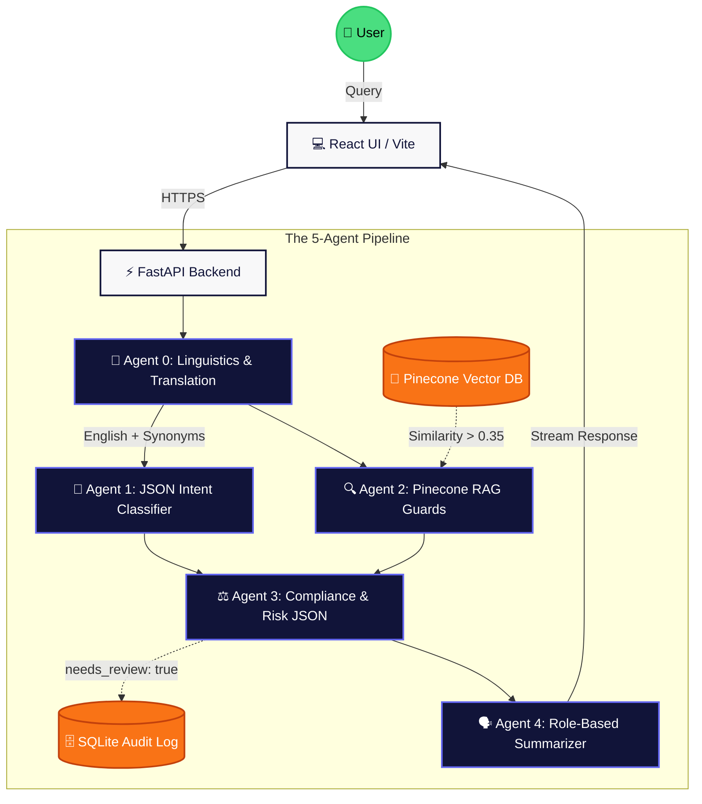

<div align="center">
  <h1>🛡️ UniGuard AI</h1>
  <h3>An Enterprise Multi-Agent Policy & Compliance Assistant</h3>
</div>

<br />

**UniGuard AI** is a deterministic, hallucination-resistant Retrieval-Augmented Generation (RAG) system built to enforce university and corporate compliance. It utilizes a highly structured **5-Agent sequential pipeline** running on LPUs (Groq Llama-3) to ingest policies, translate slang, mathematically verify rule-breaks via Pinecone vector similarity, and log high-risk queries into a SQLite audit database for human review.

---

## 🎯 1. Problem Statement
**The Problem:** Large organizations (universities, corporations) have hundreds of pages of rigid compliance policies. Enforcement is inconsistent, and when an incident occurs, locating exact penalty parameters is tedious. Standard LLMs hallucinate rules when they don't know the answer.
**The Solution:** A deterministic compliance oracle featuring mathematical context starvation. If a rule isn't in the database, the LLM is restricted from answering.

## 👥 2. Defined Users (RBAC)
1. **Students/Employees:** Query rules and receive empathetic, policy-driven explanations.
2. **Faculty/Managers:** Receive strict Standard Operating Procedures (SOPs) on enforcing policy.
3. **Administrators:** Have secure PIN-protected access to upload active policy PDFs and review automated SQLite Audit Logs of severe infractions.

---

## 🏗️ 3. Architecture Flowchart (Multi-Agent System)



---

## 🔬 4. The 5 Specialized Agents
1. **Agent 0 (NLP Translator):** Intercepts raw input (including Romanized Hindi/Telugu slang like *"godava"*), translates it to English, and dynamically injects formal legal synonyms (e.g., "physical altercation", "violence") to maximize vector search collisions.
2. **Agent 1 (Intent Classifier):** A strict JSON-enforced logic gate that securely categorizes the prompt (Hostel, Exam, Discipline) and assigns priority matrix values.
3. **Agent 2 (RAG Retrieval):** Queries **Pinecone Serverless**. Features strict Cosine Similarity Thresholds (0.35). If chunks fall below the threshold, the context is "starved" to explicitly prohibit LLM hallucination.
4. **Agent 3 (Risk Analyzer):** Evaluates the retrieved chunk against the user's intent. If severe rules (drugs, violence) are triggered, it outputs `needs_review: true`, which the FastApi backend intercepts to build an Audit Log.
5. **Agent 4 (Persona Summarizer):** The only creative LLM in the pipeline. It reads the strict context array and shapes the final Markdown response depending on whether the user is an Admin, Faculty, or Student.

---

## ⚠️ 5. Known Limitations & Flaws
*As requested for technical review evaluations:*
1. **Pipeline Latency Bottleneck:** Because the 5 Agents run *sequentially*, the total network I/O accumulates. While Groq mitigates this with ~800 tokens/sec, standard OpenAI endpoints would cause massive UX buffering. **Future Fix:** Implementing LangGraph to form a Directed Acyclic Graph (DAG) to execute Agents 1, 2, and 3 in parallel rather than sequence.
2. **RAM Exhaustion on the Free Tier:** Single-thread Python APIs (like Render's 512MB free tier) experience Out-Of-Memory (OOM) fatal crashes when parsing massive PDFs concurrently. **Current Fix:** We utilized a lazy-loaded singleton architecture and built a sequential Javascript loop in the React frontend to upload Multi-PDF batches one-by-one, releasing garbage-collector memory between packets.
3. **Textract/Multimodal Limits:** PyMuPDF struggles with scanned documents or tables. **Future Scope:** Migrating the ingestion pipeline to AWS Textract OCR.

---

## 🚀 6. Live Deployment & Setup Instructions

### 🌍 Live URLs
- **Frontend (Vercel):** https://uniguard-ai-frontend.vercel.app/
- **Backend (Render):** https://uniguard-ai-multi-agent-rag-based.onrender.com

### 🛠️ Local Setup
1. **Clone Repo & Backend Setup:**
   ```bash
   git clone <repo>
   cd UniGuard-AI-Backend
   python -m venv venv
   source venv/Scripts/activate # Windows
   pip install -r requirements.txt
   ```
2. **Environment Variables (`.env` in backend):**
   ```env
   GROQ_API_KEY=your_key
   PINECONE_API_KEY=your_key
   ```
3. **Run Backend:**
   ```bash
   uvicorn app.main:app --reload --port 8000
   ```
4. **Run Frontend (New Terminal):**
   ```bash
   cd UniGuard-AI-Frontend
   npm install
   npm run dev
   ```
