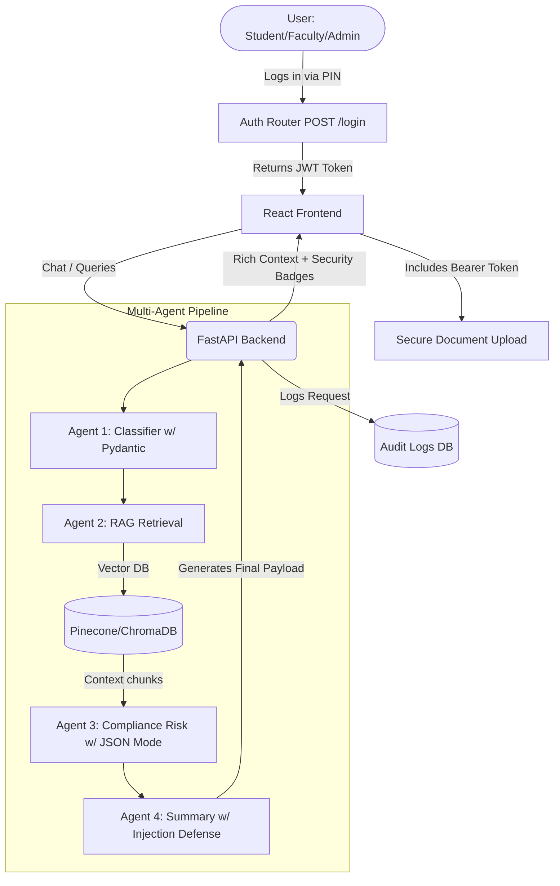

# UniGuard AI — Enterprise University Policy & Compliance Assistant (Capstone MVP)

A modernized, multi-agent GenAI system that helps students, faculty, and administration understand university policies, verify rule compliance, analyze cases, flag risky situations, and generate official summaries with citations. 

Re-engineered from a standard student chatbot into a **Startup-Grade Enterprise MVP**, this project orchestrates specialized AI agents utilizing secure backend architecture, structured LLM outputs, and real-time generation animations.

---

## 🔥 Enterprise Capstone Upgrades

*   **🔒 JWT Backend Authentication:** All sensitive API endpoints (`/upload`, `/delete`) are cryptographically secured using `PyJWT` and FastAPI `HTTPBearer`. Eliminates frontend bypass vulnerabilities.
*   **🏗️ Pydantic Structured Outputs (JSON Mode):** Replaced legacy Regex scraping with modern native LLM `json_object` mode. Classifier and Risk agents now deterministically output perfect, parseable JSON schemas.
*   **🛡️ Prompt Injection Defense:** System-level overrides strictly secure the Decision Summarizer against jailbreaks, privilege escalation, or user persona manipulation.
*   **✨ Dynamic Generative UI:** The Chat UI implements cyclic async state animations (`Analyzing Intent...` ➡️ `Retrieving Policies...`) that precisely mirror the backend execution delays, resulting in a stunning presentation demo.

## 🚀 Core RAG & Agent Features

*   **Multi-Agent Workflow Engine:** A 4-step sequential pipeline:
    1.  **Query Classifier Agent:** Determines intent strictly via JSON outputs.
    2.  **RAG Retrieval Agent:** Vector search against university PDFs using ChromaDB & SentenceTransformers with "Dynamic Context Starvation" thresholds.
    3.  **Risk & Compliance Agent:** Strict policy verification yielding Confidence Scores and Admin Review flags.
    4.  **Decision Summarizer:** Final formatting mapped to the current authenticated Persona.
*   **📊 SQLite Audit Logging:** Every query, intent, confidence score, and decision is professionally logged in a local database for administrative oversight.
*   **📑 Verifiable Source Citations:** UI renders precise glowing **Source Badges** for every chunk retrieved from the university knowledge base.

---

## 🏗️ Technical Architecture



---

## 💻 Installation & Setup

Before you begin, ensure you have **Python 3.9+** installed.

### 1. Create a Virtual Environment

```bash
python -m venv venv
venv\Scripts\activate
```

### 2. Install the RAG & Security Dependencies

```bash
pip install fastapi uvicorn pydantic requests python-dotenv langchain chromadb PyMuPDF sentence-transformers pyjwt sqlalchemy python-multipart
```

### 3. Configure the Environment

Create a `.env` file in the root folder and add your Groq API Key:

```env
GROQ_API_KEY=gsk_your_actual_api_key_here
GROQ_MODEL=llama-3.1-8b-instant
GROQ_BASE_URL=https://api.groq.com/openai/v1/chat/completions
```

> Get a free, blazing-fast inference API key at [console.groq.com](https://console.groq.com)

---

## 🏃 Running the Server

Make sure your virtual environment is activated (`venv\Scripts\activate`), then run:

```bash
uvicorn app.main:app --reload --port 8000
```

The RAG backend is now live at **http://localhost:8000**.
The ChromaDB persistent Vector Store will automatically be initialized inside `/app/data/chroma_db` along with the `audit_logs.db` SQLite file.

---

## 🛠️ Interacting with the Pipeline (Swagger UI)

Navigate to **http://localhost:8000/docs** to test the full pipeline directly in your browser.

### Step 1: Login as Admin
1. Hit `POST /auth/login` with the capstone pin (`{"pin": "admin123"}`) to receive your JWT Bearer Token.

### Step 2: Upload a PDF to the Vector Database
1. Authorize your Swagger UI using the JWT.
2. Expand **`POST /documents/upload`**  -> **"Try it out"**.
3. Choose a `.pdf` file from your device and click **Execute**. The system will silently slice, embed, and secure it.

### Step 3: Chat with your Document
1. Expand **`POST /ai/chat`** -> **"Try it out"**.
2. Ask a question regarding the PDF you just uploaded. Watch the multi-agent system process the intent, verify the risk against DB policies, and formulate the summary securely.
